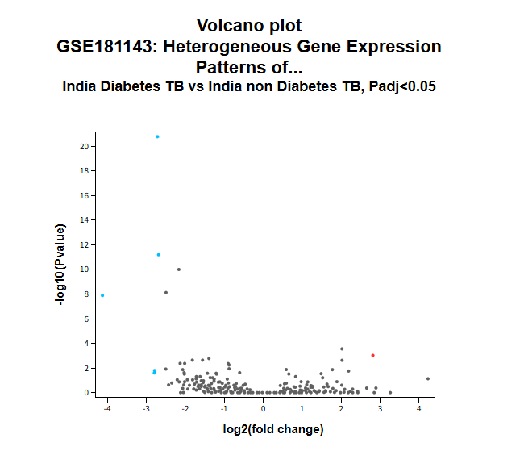

# Desafio 5.2: Análise de DEGs entre Tuberculose (TB) e Tuberculose com Diabetes (TBDM)

## Descrição do Desafio

Este desafio foi focado em genômica clínica. 

O objetivo era comparar a expressão gênica em pacientes com tuberculose (`TB`) e com diabetes (`TBDM`), utilizando dados públicos do NCBI GEO (`GSE181143`). 

A tarefa era identificar `genes diferencialmente expressos` com base nos critérios estatísticos: `p-value < 0.05`, e uma variação de expressão significativa: `logFC ≥ +2.5` para `genes superexpressos` e `logFC ≤ -2.5` para `genes subexpressos`.

## Nossa estratégia

A ferramenta [Geo2R](https://www.ncbi.nlm.nih.gov/geo/geo2r/) do NCBI GEO foi o nosso principal recurso para este desafio. 

A nossa estratégia se baseou nas seguintes etapas:

1. Identificamos e selecionamos os 8 identificadores de amostras (`GSM...`) que correspondiam aos grupos de comparação: Grupo 1 (`pacientes com TBDM`) e Grupo 2 (`pacientes com TB sem diabetes`). Dados disponíveis em: https://www.ncbi.nlm.nih.gov/geo/geo2r/?acc=GSE181143
2. No Geo2R, configuramos a análise comparativa entre os dois grupos:
   
```bash 
# Grupo 1 – Pacientes com Diabetes e Tuberculose:
GSM5490977 – Sample_1_Diabetes_TB [100002_0m]
GSM5490978 – Sample_1_Diabetes_TB [100002_2m]
GSM5490979 – Sample_1_Diabetes_TB [100002_6m]
GSM5490986 – Sample_4_Diabetes_TB [100009_0m]

# Grupo 2 – Pacientes sem Diabetes, mas com Tuberculose (Controle Negativo):
GSM5490980 – Sample_2_non Diabetes_TB [100019_0m]
GSM5490981 – Sample_2_non Diabetes_TB [100019_2m]
GSM5490982 – Sample_2_non Diabetes_TB [100019_6m]
GSM5490983 – Sample_3_non Diabetes_TB [100020_0m]
```

3. Aplicamos os critérios de filtragem fornecidos no enunciado (`p-value < 0.05`, `logFC ≥ +2.5` e `logFC ≤ -2.5`).
4. O resultado da análise nos forneceu a lista de genes que atendiam aos critérios:

## Resultados

Neste volcano plot gerado pelo Geo2R conseguimos observar os 5 genes `SubExpressos` (bolinha azul) e 1 gene `SuperExpresso` (bolinha vermelha).



Resposta submetida:

```bash
SuperExpressos: (LINC02968)
SubExpressos: (HLA-DQB1, RPH3A, USP32P1, JUP, LOC107985563)
```
